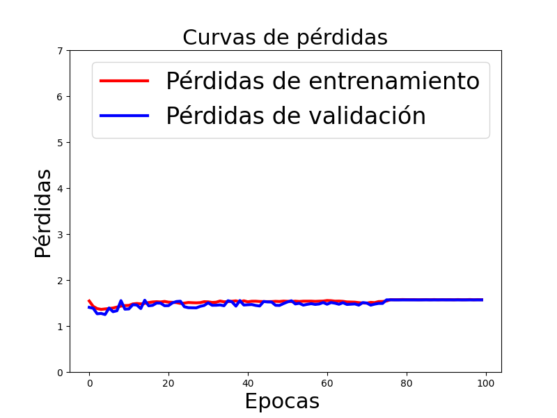
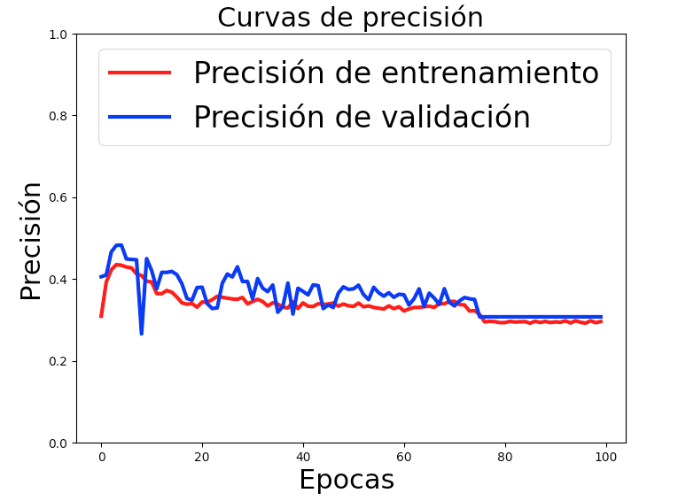

Dentro de este repositorio se encontraran dos  cosas:
1) el archivo facerecognizer que no se encuentra dentro de ninguna carpeta es la validadcion del documento base
2) La carpeta Facial-Expressions-Recognition cuenta con nuestro programa, el cual cuenta con la implementacion de el algoritmo haarcascade + el entrenamiento del modelo basado en el documento base. Dentro de esta carpeta encontrara :

  <b> I)Modelo.py </b> = este archivo cuenta con la implementacion de la red neuronal CNN,en este archivo se hara el entrenamiento con el dataset, las imagenes de validacion y las imagenes de entrenamiento, ademas de esto una vez termine de realizar el entrenamiento el archivo me generara dos graficas las cuales seran las curvas de perdidas y las curvas de precision.
  
  dentro de ester archivo  podra editar las siguientes caracteristicas
      <ul>
        <li> <b>train_data_dir: </b> El cual cuenta con la direccion a la carpeta del dataset con los datos de entrenamiento</li>
        <li> <b>validation_data_dr: </b>El cual cuenta con la direccion a la carpeta del dataset con los datos de validacion 
      </ul>
  
  
  
      #Aqui hay que poner los directorios de entrenamiento y validación
      train_data_dir ='/Users/theglox/Desktop/Desktop/UD/teleinformatica/tele/tutorial/6 RECONOCIMIENTO FACIAL/data2/train'
      validation_data_dir='/Users/theglox/Desktop/Desktop/UD/teleinformatica/tele/tutorial/6 RECONOCIMIENTO FACIAL/data2/validation'
      
  <ul>
        <li> <b>epoch: </b> El Numero de etapas que quiera que tenga su red</li>
  <li> <b>batch_size: </b>El numero de images que va a analizar el algoritmo por proceso</li>
    <li> <b>num_clases: </b>El numero de clases con el que contara  su red en el caso del documento son 5 porque contamos con 5 clases = 5 emociones</li></ul>

a continuacion podra ver un ejemplo de las graficas que nos dara este archivo una vez terminados los entrenamientos

Aqui se  encuentran las curvas en las pérdidas

Aqui se  encuentran las curvas de precisión

   <b>II)haarcascade_frontalface_default.xml </b>es un archivo  que cuenta con el modelo preentrenado de haarcascade proporcionado por opencv, no hace falta modificar nada dentro de este archivo 
   
  <ul>
        <li>SI DESEA ACCEDER A LOS OTROS MODELOS PREENTRENADOS CON LOS QUE CUENTA HAAR CASCADE PUEDE ACCEDER AL SIGUIENTE LINK: </li>
        <a href="https://github.com/opencv/opencv/tree/master/data/haarcascades"> Haar Cascades<a/>
</ul>
  
   <b>III)Emotion_little_vgg.h5 </b>= este archivo cuenta con los pedos del entrenamiento que va a generar el archivo de la red cnn, el cual se utilizara posteriormente para hacer la prediccion de la emocion a clasificar  
  
  
   <b>Iv)Facial_Expressions_Recog.py# FaceRecognition</b> = este archivo importa los dos modelos elhaarcascade_frontalface_default.xml   y Emotion_little_vgg.h5 el cual es  el modelo entrenado por nuestra red neuronal, toma los dos modelos y utliza las clases que se definen dentro de este para realizar una comparacion y poder realizar una prediccion  de la emocion, ya sea dentro de una imagen, una fotografia o un video en vivo.

  dentro de este archivo  podra editar las siguientes caracteristicas
      <ul>
        <li> <b>face_classifier: </b> El cual cuenta con la direccion a la carpeta del modelo con haar cascade</li>
        <li> <b>classifier: </b>El cual cuenta con la direccion a la carpeta de nuestro modelo entrenado</i> 
        <li> <b>class_labels</b> aqui pondra todas las clases  a las cuales les va a hacer la identificacion (emociones) </li>
        <li> <b>cap</b> Aqui selecciona la forma con la cual desea hacer identificacion </li>
      </ul>
  

  
      
